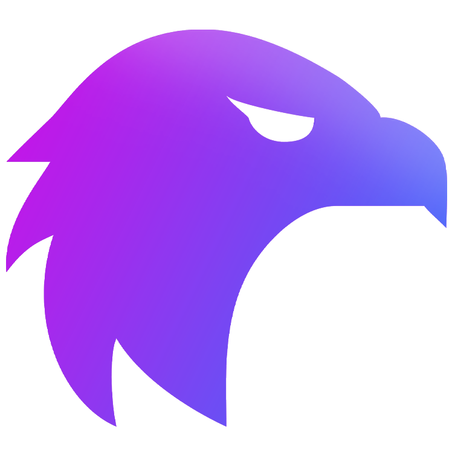
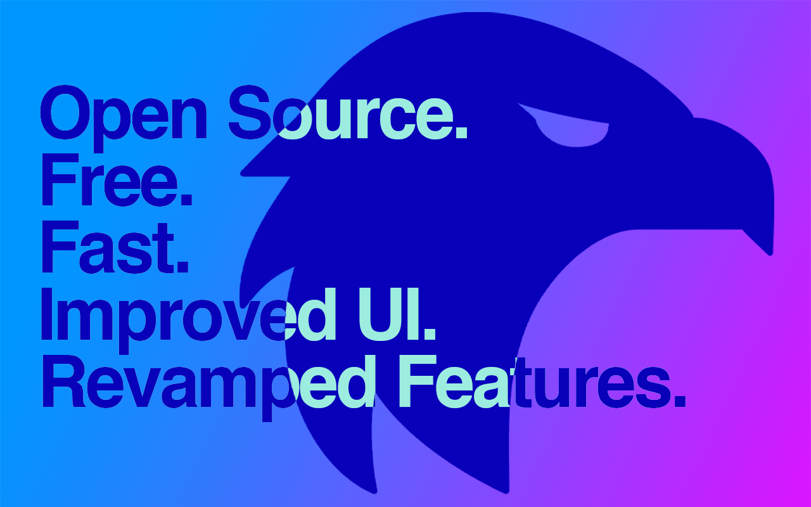

# Falcon for OWL

</img>

Falcon immensely enhances the user experience on OWL. With Falcon, OWL loads over **65% faster** on average. Falcon also improves the visual layout of OWL (including styling of buttons, forms, etc.) Falcon operates completely on the front-end and has no connection to the back-end.

Falcon is available for install on <a href="https://chrome.google.com/webstore/detail/falcon/cgmgdjmahmpdflojkflmlockjeagenmf">Google Chrome</a>, and is coming soon for Mozilla Firefox and Safari.

# Features

### Dark Mode

-----

### Load pages without refreshing

It will be much faster when you navigate OWL because a full refresh is not done every time you go to a new page. (This feature is disabled on Gradebook, Test/Quizzes, and Forum)

-----

### Revamped Resources page

The new resources page is extremely fast and offers an instant file-browsing experience. You can also search for any files or folders instantly. No more full-page refresh just to browse folders. And if for any reason you need to access the old resources system, you are just one click away.

-----

### Edit course names

Especially useful when you're just starting a new semester, and you're not used to the course codes yet.

-----

### New Announcements Experience

Scroll through all your announcements at once like it's your personal feed.

-----

### Powerful New Editor

Falcon includes a new editor which you can use to create flow charts, diagrams, and more. Each course gets its own editor, and changes are saved instantly. You can also export your diagrams as PNG, JPG or SVG.

-----

### Instant Search & Sorting of Announcements, Assignments, etc

OWL offers sorting of announcements, assignments, etc. but it takes a *full* page refresh just to sort, making it an awful experience. Falcon sorts *instantly*. Falcon also allows you to search tables, too.

----

Of course, the features listed here are the main features you can visually interact with / see on OWL. There are many minor enhancements to OWL itself that Falcon makes that improves the user experience. One of which is a more modern and updated look without taking away from the OWL you are familiar with.

# Installation
Falcon is available on the <a href="https://chrome.google.com/webstore/detail/falcon/cgmgdjmahmpdflojkflmlockjeagenmf">Chrome Web Store</a> for easy install.

1. Go to the <a href="https://github.com/RishabSwift/Falcon/releases">releases page</a> and download the latest version, and extract it
2. Go to `chrome://extensions` and toggle on `Developer Mode` on the top right
3. On the same page, you should now see three new buttons. Click on the `Load unpacked` button and select `dist/chrome` from the extracted directory
4. That's it! Falcon is now running!

If there are any updates, then you will need to reinstall it manually. However, once it's available on the Chrome store, updating Falcon is just like updating any other Chrome extensions.

# Security Notice
Falcon was built with security in mind. Using Falcon does not compromise the security of OWL. In fact, it enhances certain security elements of OWL, particularly in the case of POST-based browsing.

Falcon works on top of OWL, and it makes no external requests to any external endpoints (with the exception of asset files). Falcon also does not collect any inputs, form data, session data, or any other relevant information. You are free to inspect the source code!

# Run into issues?
If you encounter any issues that prevent you from using OWL normally, please disable or uninstall Falcon until it is fixed.

If you run into any issues, then I'd really appreciate it if you could either create a <a href="https://github.com/RishabSwift/Falcon/issues"> new issue here </a> or email me at swift@hey.com.

# Contribution
Feel free to fork Falcon and create a pull request!

Contribution can be anything from fixing spelling mistakes to implementing new features.

Some tips to help you get started:
- Ensure you have <a href="https://docs.npmjs.com/downloading-and-installing-node-js-and-npm">node.js and NPM</a> installed.
- While developing, you will need to build it and load it in chrome manually. i.e. run `npm run dev` from the base directory. It will create a new `dist` directory with folders for `chrome` and `firefox`.
- It may be cumbersome to type in `npm run dev` every time you make any changes. You can use the `npm run watch` command to automatically compile the source code upon any change.
- Use Falcon's API for fluid development
    - `AssetInjector` for injecting resources to any page (including `iframes`)
    - `FalconStorage` for saving / querying user's data
    - `FalconInterfaceInjector` to save and inject elements on any page

If you have any questions, ideas, or concerns, please send them over to swift@hey.com or create a <a href="https://github.com/RishabSwift/Falcon/issues"> new issue </a>.

# License

See [LICENSE](/LICENSE.md) for more information.
